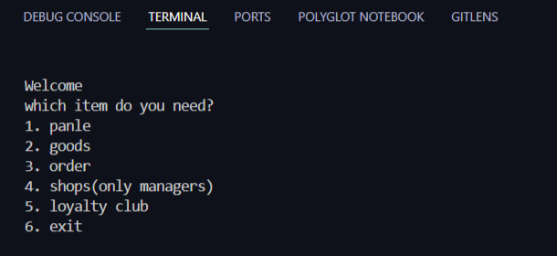

# shop

This is a console based shop project.



## Features
- Registration
- Multi-store project
- Loyalty cbub
- Decent panel

## Setup
``` bash 
$ git clone https://github.com/RoxanaNegaresh/shop.git
$ cd shop
```

## Setup Database
Start WampServe or XAMPP 
 ```bash
   pip install -r requirements.txt
   python create_db.py
```

Run Shop.py


